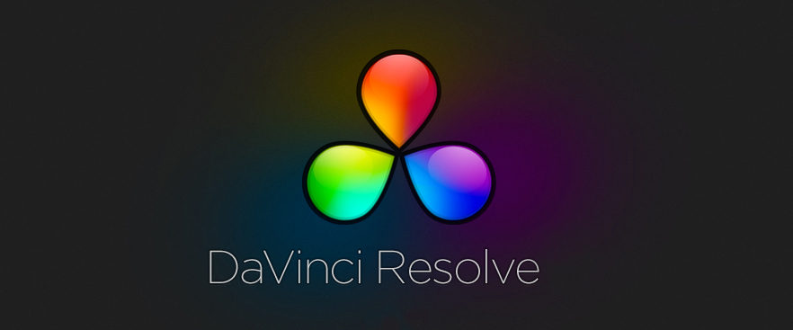

# resolve-lib-fix



Quick correction about DaVinci Resolve & DaVinci Resolve Studio related to libraries.

## Fast Fix

```sh
wget https://raw.githubusercontent.com/gabrielcapilla/resolve-lib-fix/main/resolve-fix && sh resolve-fix
```

The issue is, that resolve brings it’s own *glib2*, but not it’s own *pango*. It uses system-provided pango, which in turn assumes newer glib2 than resolve’s. The workaround is to move all glib2 libraries out of `/opt/resolve/libs` to somewhere else `(/opt/resolve/libs/_disabled`, for example). After that, resolve will pick system-provided glib2 and pango will be happy with that. The downside is, that Resolve wasn’t QA-ed with this glib2 version, so it may bug out somewhere else. On the other hand, at least it will start. Only need to move those files that belong to glib2: libgio, libglib, libgmodule*, libgobject*.**

## Do it manual

Access to the location

```sh
cd /opt/resolve/lib
```

Create the folder *_disabled* in `/opt/resolve/libs/` to move the *glib2* libraries there:

```sh
sudo mkdir /opt/resolve/libs/_disabled
```

And then, move the glib2 inside the *_disabled* folder:

```sh
sudo mv libgio* libglib* libgmodule* libgobject* _disabled
```
